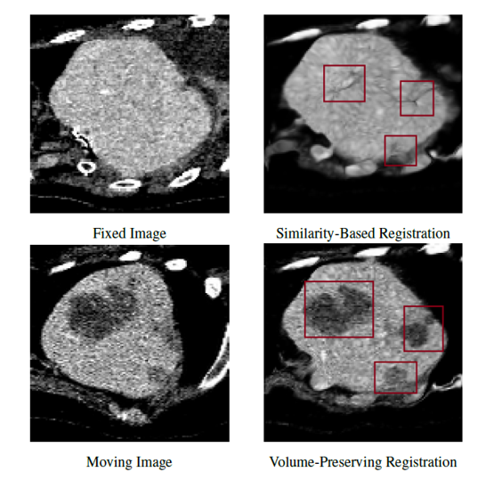

# Preserving Tumor Volumes for Unsupervised Medical Image Registration (ICCV 2023)

by Qihua Dong, Hao Du, Ying Song, Yan Xu, Jing Liao

[[ICCV Version]](https://openaccess.thecvf.com/content/ICCV2023/papers/Dong_Preserving_Tumor_Volumes_for_Unsupervised_Medical_Image_Registration_ICCV_2023_paper.pdf), [[arXiv]](https://arxiv.org/abs/2309.10153), [[Project]](https://dddraxxx.github.io/Volume-Preserving-Registration/)

## Inroduction
Medical image registration is a critical task that estimates the spatial correspondence between pairs of images. However, current traditional and deep-learning-based methods rely on similarity measures to generate a deforming field, which often results in disproportionate volume changes in dissimilar regions, especially in tumor regions. These changes can significantly alter the tumor size and underlying anatomy, which limits the practical use of image registration in clinical diagnosis. To address this issue, we have formulated image registration with tumors as a constraint problem that preserves tumor volumes while maximizing image similarity in other normal regions.
<p align="center">
  
</p>

This repository includes:

* Training and testing scripts using Python and Torch
* Implementation of volume-preserving registration network [RCN](https://github.com/microsoft/Recursive-Cascaded-Networks), [VXM](https://github.com/voxelmorph/voxelmorph/tree/dev) and [TSM](https://github.com/junyuchen245/TransMorph_Transformer_for_Medical_Image_Registration)
* The volume-preserving loss

> :warning: **Note:** This project is currently under active development. The open-source code is still being refined. We welcome suggestions, feedback, and contributions. Please feel free to [open an issue](https://github.com/dddraxxx/Medical-Reg-with-Volume-Preserving/issues) or submit a pull request!

If you use the code or the models in your research, please cite:
```
@inproceedings{dong2023preserving,
  title={Preserving Tumor Volumes for Unsupervised Medical Image Registration},
  author={Dong, Qihua and Du, Hao and Song, Ying and Xu, Yan and Liao, Jing},
  booktitle={Proceedings of the IEEE/CVF International Conference on Computer Vision},
  pages={21208--21218},
  year={2023}
}
```

## Dataset

The `dataset` folder provides sample JSON files for your reference. However, it cannot be directly used here (containing private test data). For training and testing data, you could refer to [RCN](https://github.com/microsoft/Recursive-Cascaded-Networks#datasets) and directly download their data file as a start point.

You could also build your own H5 and JSON files. Each instance in H5 file is a complete 3D image with standard preprocessing (refer to [nnUNet](https://github.com/MIC-DKFZ/nnUNet)) and is resized to 128x128x128.

## Installation
`pip install -r requirements.txt`

## Training
There are three network bases you could choose from: VTN, VXM, and TSM. Please refer to the code if you want to tweak the training in detail.

To train the similarity-based version of the network:
```
python train_simple.py -d datasets/liver_cust.json --name normal-vxm -base VTN
```
To train the volume-preserving version of the network:
```
python train_simple.py -d datasets/liver_cust.json --name adaptive-vtn -m soft -trsf sigm -use2 1 -bnd_thick 0.5 --mask_threshold 1.5 -vp 0.1 -st dynamic -base VTN
```

## Evaluation
To evaluate the specific checkpoint:
```
python eval/eval.py -d datasets/liver_cust.json -g gpu_id -v val_subset -c path_to_checkpoint_dir
```

## Acknowledgement

Credit to https://github.com/microsoft/Recursive-Cascaded-Networks and https://github.com/ivan-jgr/recursive-cascaded-networks.
