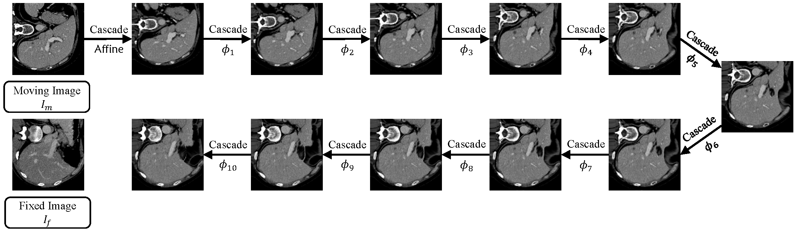
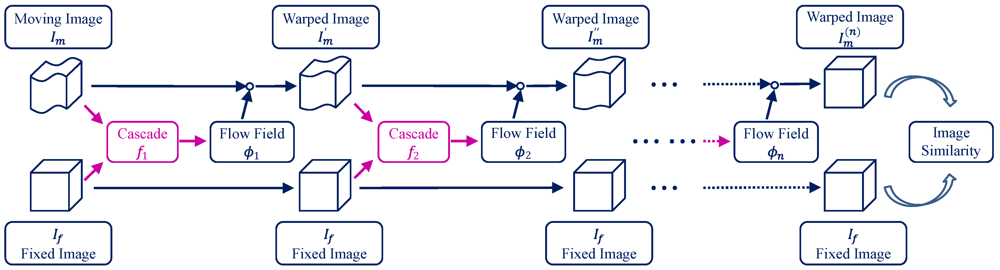

 This is a pytorch version of the [original tensorflow implementation](https://github.com/microsoft/Recursive-Cascaded-Networks). 

# Recursive Cascaded Networks for Unsupervised Medical Image Registration

Paper link: [[arXiv]](https://arxiv.org/pdf/1907.12353)

*Recursive cascaded networks*, a general architecture that enables learning deep cascades, for deformable image registration. The moving image is warped successively by each cascade and finally aligned to the fixed image.

This repository includes:

* The recursive cascade network implementation with VTN as a base network for 3D and 2D images.

## Dataset

Refers to https://github.com/microsoft/Recursive-Cascaded-Networks#datasets.

## Training

`python train.py -d DATASET -g GPU_ID`

## Acknowledgement

This is a pytorch version based on the implementation: https://github.com/microsoft/Recursive-Cascaded-Networks and https://github.com/ivan-jgr/recursive-cascaded-networks.
