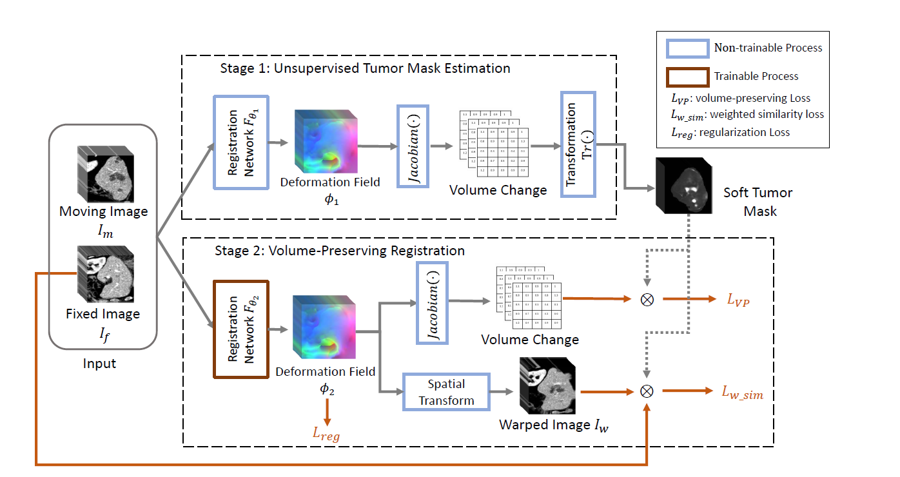

# Preserving Tumor Volumes for Unsupervised Medical Image Registration (ICCV 2023)

by Qihua Dong, Hao Du, Ying Song, Yan Xu, Jing Liao

Paper link: [[arXiv]](https://arxiv.org/abs/2309.10153)

## Inroduction

This repository includes:

* The Volume-Preserving-Registration Networks for 3D medical images.

If you use the code, the models, or our data in your research, please cite:
@inproceedings{dong2023preserving,
  title={Preserving Tumor Volumes for Unsupervised Medical Image Registration},
  author={Dong, Qihua and Du, Hao and Song, Ying and Xu, Yan and Liao, Jing},
  booktitle={Proceedings of the IEEE/CVF International Conference on Computer Vision},
  pages={21208--21218},
  year={2023}
}
``

## Dataset

Refers to https://github.com/microsoft/Recursive-Cascaded-Networks#datasets.

## Training

`python train.py -d DATASET -g GPU_ID`

## Evaluation

## Acknowledgement

This is a pytorch version based on the implementation: https://github.com/microsoft/Recursive-Cascaded-Networks and https://github.com/ivan-jgr/recursive-cascaded-networks.
